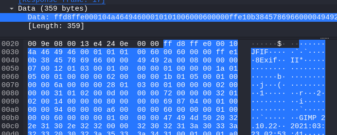
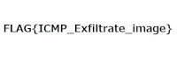

# illegal image (271pt Hard)
# 問題文

裏で画像がやり取りされているらしい

# やったこと
zipファイルを展開したらpcapファイルが出てきた．

wiresharkで眺めていたら，ICMPパケットの中に'JFIF'とか'GIMP'など画像データっぽい文字列を見つけることが出来た．



そこで，ICMPパケットのデータ部を集めて画像を作ることを試みた．

```python
from scapy.all import *

p = rdpcap('illegal_image.pcap').filter(lambda p:Raw in p and ICMP in p and p['IP'].src == '192.168.0.158')

data = b''
for i in range(len(p)):

    load = p[i]['Raw'].load
    data += load

print(data)

with open('data.jpg', 'wb') as f:
    f.write(data)
    f.close()
```

実行したところ,フラグが描かれた画像ファイルが得られた．



# フラグ
FLAG{ICMP_Exfiltate_image}

