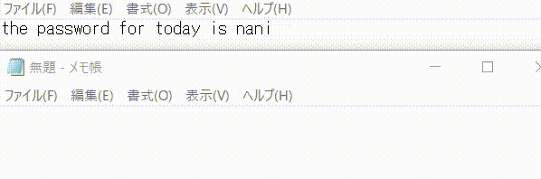
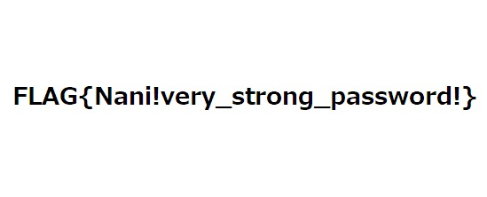

# secure document (207pt Easy)
# 問題文
本日の資料は以下を入力して圧縮しました。

`the password for today is nani`

# やったこと

zipファイルを展開すると暗号化されたzipファイルとpassword-generatorなる謎のファイルが出てきた．

```
::the::
Send, +wani
return

::password::
Send, +c+t+f
return

::for::
Send, {home}{right 3}{del}1{end}{left 2}{del}7
return

::today::
FormatTime , x,, yyyyMMdd
SendInput, {home}{right 4}_%x%
return

::is::
Send, _{end}{!}{!}{left}
return

:*?:ni::
Send, ^a^c{Esc}{home}password{:} {end}
return
```

キーバインドを変更しようとしたときに見たことがある形式？
多分AutoHotKeyの設定ファイル

AutoHotKeyをインストール済みの端末にファイルを移動．

拡張子を変更 `password-generator.ahk` 

AutoHotKeyに読み込ませてから，問題文の文字列を入力するとパスワードが得られた．



```
password: Wan1_20210501_C7F!na!
```

得られたパスワードの日付部分をzipファイルの名前に合わせて変更する
```
Wan1_20210428_C7F!na!
```

これを使ってzipファイルを展開したらflag.jpgが出てきた．



# フラグ
FLAG{Nani!very_strong_password!}

