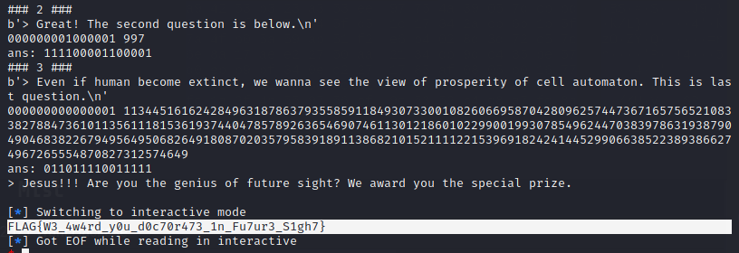

# Automaton Lab. (262pt Normal)
# 問題文

Automaton Lab.で将来予測のお手伝いをしましょう

nc automaton.mis.wanictf.org 50020
reference: https://en.wikipedia.org/wiki/Rule_30

# やったこと

zipファイルを展開したところ，サーバ側のスクリプトが出てきました．
全部で3問出題されて，全て正解するとフラグがもらえるようです．

```python
import sys
from concurrent.futures import ThreadPoolExecutor
import random
from Crypto.Util.number import getPrime

import const
import automaton

cells = 15


def checkanswer(reference, answer):
    if len(answer) != cells:
        print(const.error)
        sys.exit()
    for c in answer:
        if not (c == "0" or c == "1"):
            print(const.error)
            sys.exit()
    answer = int(answer, 2)
    if reference != answer:
        print(const.lose)
        sys.exit()
    return

solver = automaton.rule30(bits=cells)
print(const.message1)
input()

# 1st Question
init = random.randint(1, 2**cells - 2)
gen = 7
reference = solver.solve(init, gen)
print(const.quiz1)
print("init = " + format(init, "0"+str(cells)+"b"))
print("gen = " + str(gen))
answer = input("> ")
checkanswer(reference, answer)

# 2nd Question
init = (1 << random.randint(0, cells-1)) | (1 << random.randint(0, cells-1))
gen = 997
reference = solver.solve(init, gen)
print(const.quiz2)
print("init = " + format(init, "0"+str(cells)+"b"))
print("gen = " + str(gen))
answer = input("> ")
checkanswer(reference, answer)

# 3rd Quiestion
init = 1
gen = getPrime(1024)
reference = solver.solve(init, gen)
print(const.quiz3)
print("init = " + format(init, "0"+str(cells)+"b"))
print("gen = " + str(gen))
answer = input("> ")
checkanswer(reference, answer)

# Congratz
print(const.message2)
print(const.flag)
```

問題は，最初の状態と求める世代nが与えられるので．
Rule 30にしたがってn世代だけ状態遷移したときの状態を計算せよよいう問題でした．

Rule 30については問題についてたリンク先のwikiに書いてありました．
対象のビットとその前後のビット，合計3ビットから次のビットの値が決まるようです．

wikiを読んだ通りのアルゴリズムでは，第1問，第2問は正解することが出来ましたが，第3問では求める世代が非常に遠く，そのままでは解けませんでした．

```python
def next(state):
    state = state[-1] + state + state[0]
    res = ''

    for i in range(1, 16):
        tmp = state[i-1:i+2]
        
        if tmp in ('111', '110', '101', '000'):
            res += '0'

        else:
            res += '1'

    return res


def solve(init, gen):

    for i in range(gen):
        init = next(init)

    return init

if __name__ == '__main__':
    for i in range(3):
        init, gen = input().split()
        res = solve(init, int(gen))
        print('ans:', res)
```

そこで，第3問では初期状態が固定されていることに目をつけ，
周期性や状態数を調べることにしました．

すると状態数は1052種類しかないことが分かりました．
おそらくどこかの地点でループしているのでしょう．

第3問の答えは，1052種類しかないため，
第1問，第2問は普通に計算を行い，
第3問だけは1/1052の運ゲーにしました．

自動化スクリプトを以下のように書いて実行しました．

```python
from pwn import *
from solver import solve

with open('list') as f:
    ls = [i.replace('\n', '') for i in f.readlines()]

for i in ls:
    con = remote('automaton.mis.wanictf.org', 50020)

    con.recvuntil('(press enter key to continue)')
    con.send('\n')
    con.recvline()

    # 1
    print('### 1 ###')
    print(con.recvline())
    init = con.recvline().split()[-1].decode()
    gen  = int(con.recvline().split()[-1])
    print(init, gen)

    ans = solve(str(init), gen)
    print('ans:', ans)
    con.sendline(ans)

    # 2
    print('### 2 ###')
    print(con.recvline())
    init = con.recvline().split()[-1].decode()
    gen  = int(con.recvline().split()[-1])
    print(init, gen)

    ans = solve(init, gen)
    print('ans:', ans)
    con.sendline(ans)

    # 3
    print('### 3 ###')
    print(con.recvline())
    init = con.recvline().split()[-1].decode()
    gen  = int(con.recvline().split()[-1])

    print(init, gen)

    ans = i
    print('ans:', ans)
    con.sendline(ans)
    res = con.recvline().decode()
    print(res)
    if 'disappointed' in res:
        con.close()
        continue
    else:
        break

con.interactive()
```

平行して，周期性を使って解く方法を検討していましたが，意外と早く答えが当選していました．



# フラグ
FLAG{W3_4w4rd_y0u_d0c70r473_1n_Fu7ur3_S1gh7}


