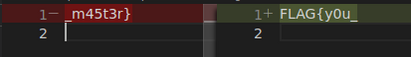
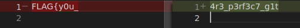

# Git Master (217pt Easy)
# 問題文
https://hub.docker.com/r/wanictf21spring/nginx_on_ubuntu

ホームページをみんなで開発したいので、イメージを公開するです。

昔、秘密の文字列をコミットしたことがあるけど大丈夫だよね...？

# やったこと

zipファイルを展開するとDockerfileが入っていました．

```docker
FROM ubuntu:20.04

LABEL maintainer="wanictf21spring@gmail.com"

RUN apt update \
 && apt install -y nginx

EXPOSE 80

COPY . /var/www

CMD ["/usr/sbin/nginx", "-g", "daemon off;"]

```

リンク先のdockerのコンテナを動かして，中を見てみます．

```
$ sudo docker run -it wanictf21spring/nginx_on_ubuntu /bin/sh
...
# ls
bin   dev  home  lib32  libx32  mnt  proc  run   srv  tmp  var
boot  etc  lib   lib64  media   opt  root  sbin  sys  usr

# cd var/www
# ls -a
.  ..  .git  Dockerfile  docker-compose.yml  html

# ls html
Flag.txt  assets  favicon.ico  index.html  index.nginx-debian.html
```

.gitディレクトリがありました．
これがあるとgitコマンドで過去の変更を確認できます．

ホスト側にこのディレクトリをコピーして持ってきます．

```
$ sudo docker cp 89c8d48a3829:/var/www www
```

 VSCodeを使ってFlag.txtの過去の変更を確認してみます．
 
 

 フラグの後半部分が見えました．
 
 合体させるとFLAG{y0u__m45t3r}になりますが，これは答えではなかったです．
 
 もう一度確認するとtemporaryブランチもありました．

 ```
 $ git branch         
* master
  temporary
```

ブランチを切り替えて再確認すると，フラグの真ん中部分が現れました．



 全部を合体させたフラグは正解でした．

# フラグ
FLAG{y0u_4r3_p3rf3c7_g1t_m45t3r}
