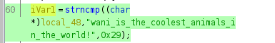

# secret (150pt Beginner)
# 問題文
この問題では Linux の ELF 実行ファイル(バイナリ)である「secret」が配布されています。

このバイナリを実行すると secret key を入力するように表示されます。

試しに「abcde」と入力してみると「Incorrect」と言われました。

```
$ file secret
secret: ELF 64-bit LSB pie executable, x86-64, version 1 (SYSV), dynamically linked, interpreter /lib64/ld-linux-x86-64.so.2, BuildID[sha1]=1daf4ab43cfa357911806c3ccae34a1b6e027913, for GNU/Linux 3.2.0, not stripped

$ sudo chmod +x secret

$ ./secret
...
Input secret key : abcde
Incorrect

$ ./secret
...
Input secret key : ??????
Correct! Flag is ??????
```
このバイナリが正しいと判断する secret key を見つけて読み込んでみましょう！

(secret key とフラグは別の文字列です)

(このファイルを実行するためには Linux 環境が必要となりますので WSL や VirtualBox で用意してください)

ヒント :「表層解析」や「静的解析」を行うことで secret key が見つかるかも...?

表層解析ツール strings

静的解析ツール Ghidra

# やったこと
zipファイルを展開するとELF実行ファイルsecretが出てきました．
Ghidraで開いてみると，入力値と文字列を比較している部分がありました．



この文字列を入力するとフラグが表示されました．

```
 $ ./secret 

   ▄▀▀▀▀▄  ▄▀▀█▄▄▄▄  ▄▀▄▄▄▄   ▄▀▀▄▀▀▀▄  ▄▀▀█▄▄▄▄  ▄▀▀▀█▀▀▄
  █ █   ▐ ▐  ▄▀   ▐ █ █    ▌ █   █   █ ▐  ▄▀   ▐ █    █  ▐
     ▀▄     █▄▄▄▄▄  ▐ █      ▐  █▀▀█▀    █▄▄▄▄▄  ▐   █
  ▀▄   █    █    ▌    █       ▄▀    █    █    ▌     █
   █▀▀▀    ▄▀▄▄▄▄    ▄▀▄▄▄▄▀ █     █    ▄▀▄▄▄▄    ▄▀
   ▐       █    ▐   █     ▐  ▐     ▐    █    ▐   █
           ▐        ▐                   ▐        ▐

Input secret key : wani_is_the_coolest_animals_in_the_world!
Correct! Flag is FLAG{ana1yze_4nd_strin6s_and_execu7e_6in}
```

# フラグ
FLAG{ana1yze_4nd_strin6s_and_execu7e_6in}
