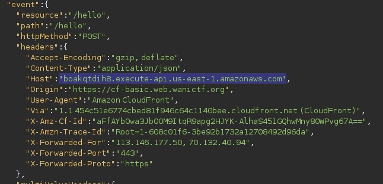

# CloudFront Basic Auth (282pt Hard)
# 問題文
API Gateway, Lambda, S3, CloudFront, CloudFormationを使ってアプリを作ってみました。

重要なエンドポイントにはBasic認証をつけてみました。

https://cf-basic.web.wanictf.org/

ヒント: 上のURLにアクセスするとexceptionと同じ見た目のWebアプリが表示されますが、添付されているzipファイルにはexceptionの添付ファイルから新しいファイルが追加されています。添付ファイルを参考にもう一つのFLAGを発見してください！

# やったこと

与えられたリンクにアクセスすると，
挨拶するアプリケーションが表示された．


zipファイルを展開すると
template.yamlなるファイルが入っていた．

よく読むとわかりやすいコメントがついていた．
```yaml
...
# "https://${APIID}.execute-api.${AWS::Region}.amazonaws.com/Prod/hello"にPOSTするとHelloFunctionが動く
...
# "https://${APIID}.execute-api.${AWS::Region}.amazonaws.com/Prod/admin"にGETするとAdminFunctionが動く
...
```

\${APIID}と\${AWS::Region}がよく分からないが，
exceptionのフラグを得たときに似たような形式のリンクを見たことを思い出した．



コメントの内容から，

/Prod/helloにPOSTするとHelloFunctionが動くらしい

```
$ curl -X POST "https://boakqtdih8.execute-api.us-east-1.amazonaws.com/Prod/hello" -d '{"name":"aaa"}'
{"name": "\u3053\u3093\u306b\u3061\u306f\u3001aaa\u3055\u3093"}  
```
なるほど

同じように/Prod/admin"にGETするとAdminFunctionが動くらしい

```
$ curl "https://boakqtdih8.execute-api.us-east-1.amazonaws.com/Prod/admin"                            
FLAG{ap1_g4teway_acc3ss_con7rol}   
```

フラグが返ってきた

# フラグ
FLAG{ap1_g4teway_acc3ss_con7rol}   

