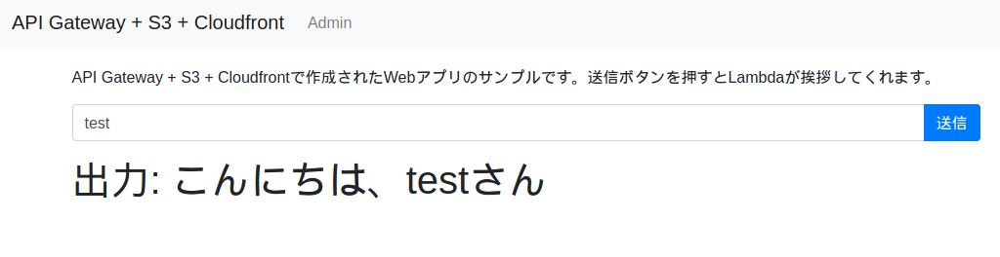
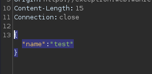
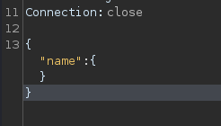
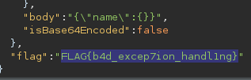

# exception (186pt Easy)
# 問題文
API Gateway, Lambda, S3, CloudFront, CloudFormationを使ってアプリを作ってみました。

https://exception.web.wanictf.org/

# やったこと

リンクにアクセスすると，入力した名前を使って挨拶を返すアプリが表示された．



burpsuiteで確認すると，jsonの形式でデータをやりとりしているようだ．



zipファイルを展開するとサーバ側で動くpythonスクリプトが出てきた．

```python
import json
import os
import traceback

# HelloFunction(/hello)のコード
def lambda_handler(event, context):
    try:
        try:
            data = json.loads(event["body"])
        except Exception:
            data = {}
        if "name" in data:
            return {
                "statusCode": 200,
                "body": json.dumps({"name": "こんにちは、" + data["name"] + "さん"}),
            }
        return {
            "statusCode": 400,
            "body": json.dumps(
                {
                    "error_message": "Bad Request",
                }
            ),
        }
    except Exception as e:
        error_message = traceback.format_exception_only(type(e), e)
        del event["requestContext"]["accountId"]
        del event["requestContext"]["resourceId"]
        return {
            "statusCode": 500,
            "body": json.dumps(
                {
                    "error_message": error_message,
                    "event": event,
                    "flag": os.environ.get("FLAG"),
                }
            ),
        }
```

問題文にある通り，例外を発生させるとフラグがもらえるっぽい．

burpsuiteでjsonデータをいじって以下の形式で送信してみたら例外が発生してフラグが得られた．





# フラグ

FLAG{b4d_excep7ion_handl1ng}
