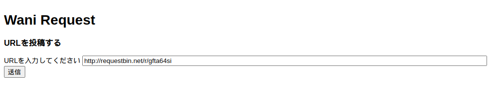
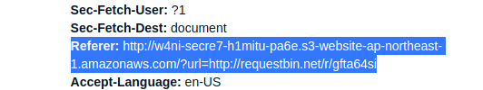
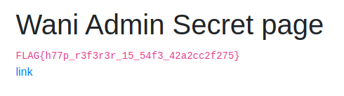

# Wani Request 1 (148pt Easy)

# 問題文
RequestBinを使ってみよう!!

https://request1.web.wanictf.org/

この問題ではあどみんちゃんから自分のサーバにアクセスしてもらう必要があります。

自前でサーバを用意するのが難しい方はRequestBinなどのサービスを利用してみましょう。

サーバが用意出来たらいよいよ本番です。

問題ページにアクセスし、あなたが用意したサーバのURLを送信してください。

送信するとあどみんちゃんの秘密のページにあなたの送信したURLのリンクが表示されます。

あどみんちゃんは表示されたリンクをクリックしてあなたのサーバにアクセスしてくれます。

あどみんちゃんからのアクセスを分析して秘密のページを探してみてください。

HINT1 : HTTP ヘッダー
HINT2 : xss問題ではありません。

# やったこと

与えられたリンクにアクセスすると
URLを入力するフォームが表示された．
あどみんちゃんがここにアクセスするみたいだ．

RequestBinでリンクを作って，そこにアクセスしてもらう．

RequestBinで確認すると，アクセスがきていた．
Refererを見るとどこのページから来たのかを確認できる．

このリンクにアクセスするとフラグが表示された．

# フラグ
FLAG{h77p_r3f3r3r_15_54f3_42a2cc2f275}
